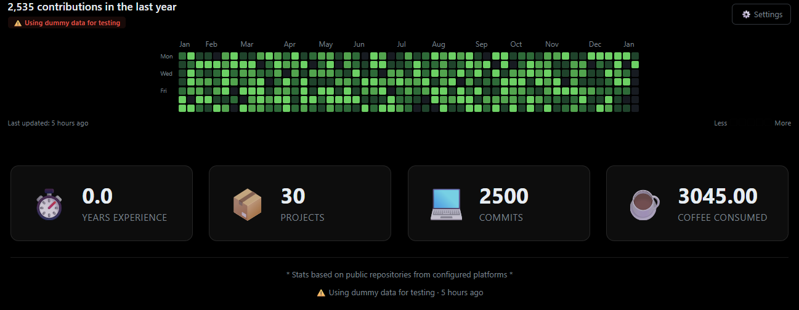

# vue-git-stats



> Beautiful GitHub/GitLab contribution graphs and stats for Vue 3 with automated data fetching via GitHub Actions

[](https://www.npmjs.com/package/vue-git-stats)
[](https://opensource.org/licenses/MIT)

## Features

✨ **Multiple Platforms** - Support for GitHub, GitLab, and Bitbucket  
🎨 **Customizable** - Multiple color schemes and display options  
⚡ **Fast** - Static data files updated via GitHub Actions, zero runtime API calls  
🛡️ **Reliable** - Multi-tier fallback system (static → cache → mock data)  
📱 **Responsive** - Mobile-friendly with smooth scrolling  
🎯 **Zero Config** - Works out of the box with sensible defaults  
🔧 **Type Safe** - Full TypeScript support (coming soon)

## Demo

[View Live Demo](https://derekjohnston.ca/demo)

## Installation

```bash
npm install vue-git-stats
```

## Quick Start

### 1. Initialize in your project

```bash
npx vue-git-stats init
```

This creates:
- `git-stats.config.js` - Configuration file
- `.github/workflows/update-git-stats.yml` - GitHub Action workflow
- `public/data/` - Directory for stats data

### 2. Configure your profiles

Edit `git-stats.config.js`:

```javascript
export default {
  profiles: [
    {
      username: 'your-github-username',
      platform: 'github',
      tokenSecret: 'GITHUB_TOKEN'
    },
    {
      username: 'your-gitlab-username',
      platform: 'gitlab',
      tokenSecret: 'GITLAB_TOKEN'
    }
  ],
  dataPath: 'public/data/git-stats.json',
  schedule: '0 2 * * *', // Daily at 2 AM UTC
}
```

### 3. Add GitHub Secrets

Go to your repository **Settings → Secrets and variables → Actions** and add:
- `GITHUB_TOKEN` (automatically provided by GitHub)
- `GITLAB_TOKEN` (if using GitLab)

### 4. Use in your Vue components

```vue
<template>
  <div>
    <ContributionGraph 
      data-url="/data/git-stats.json"
      color-scheme="green"
    />
    
    <StatsBreakdown 
      data-url="/data/git-stats.json"
    />
  </div>
</template>

<script setup>
import { ContributionGraph, StatsBreakdown } from 'vue-git-stats'
import 'vue-git-stats/style.css'
</script>
```

## Components

### ContributionGraph

Displays a GitHub-style contribution heatmap.

**Props:**
- `dataUrl` (String) - Path to stats JSON file (default: `/data/git-stats.json`)
- `profileIndex` (Number) - Which profile to display if you have multiple (default: `0`)
- `colorScheme` (String) - Color theme: `green`, `blue`, `purple`, `orange` (default: `green`)
- `showSettings` (Boolean) - Show color scheme dropdown (default: `true`)
- `cacheTTL` (Number) - Cache duration in milliseconds (default: `24 hours`)

**Events:**
- `@day-click` - Emitted when a day is clicked `{ date, count }`
- `@color-scheme-change` - Emitted when color scheme changes

**Example:**
```vue
<ContributionGraph 
  data-url="/data/git-stats.json"
  :profile-index="0"
  color-scheme="blue"
  :show-settings="true"
  @day-click="handleDayClick"
/>
```

### StatsBreakdown

Displays project and commit count statistics.

**Props:**
- `dataUrl` (String) - Path to stats JSON file
- `profileIndex` (Number) - Which profile to display

**Example:**
```vue
<StatsBreakdown 
  data-url="/data/git-stats.json"
  :profile-index="0"
/>
```

## Configuration

### Full Configuration Options

```javascript
// git-stats.config.js
export default {
  // Profiles to fetch stats from
  profiles: [
    {
      username: 'username',
      platform: 'github', // 'github' | 'gitlab' | 'bitbucket'
      tokenSecret: 'GITHUB_TOKEN' // GitHub secret name
    }
  ],
  
  // Data file location
  dataPath: 'public/data/git-stats.json',
  
  // Update schedule (cron format)
  schedule: '0 2 * * *',
  
  // Display options
  display: {
    colorScheme: 'green',
    showPrivateContributions: false
  },
  
  // Features to enable
  features: {
    contributionGraph: true,
    statsBreakdown: true
  },
  
  // Browser caching
  cache: {
    browserTTL: 24 * 60 * 60 * 1000, // 24 hours
    useStaleCache: true
  }
}
```

## How It Works

1. **GitHub Actions** runs on a schedule (e.g., daily)
2. **Fetches data** from configured platforms (GitHub, GitLab, etc.)
3. **Saves to static file** in your repository
4. **Components load** from the static file (fast, reliable)
5. **Falls back** to cache or mock data if file unavailable

### Why This Approach?

- ✅ **No runtime API calls** - Visitors never hit rate limits
- ✅ **Fast loading** - Static file loads instantly
- ✅ **Never breaks** - Always has fallback data
- ✅ **Free tier friendly** - One API call per day vs thousands
- ✅ **Works offline** - Can develop with cached/mock data

## Advanced Usage

### Using the Composable Directly

```vue
<script setup>
import { useGitStats } from 'vue-git-stats'

const { data, loading, dataSourceText, lastUpdatedText } = useGitStats({
  dataUrl: '/data/git-stats.json',
  cacheTTL: 24 * 60 * 60 * 1000,
  useStaleCache: true
})
</script>

<template>
  <div v-if="loading">Loading...</div>
  <div v-else>
    <p>{{ dataSourceText }}</p>
    <p>{{ lastUpdatedText }}</p>
    <pre>{{ JSON.stringify(data, null, 2) }}</pre>
  </div>
</template>
```

### Multiple Profiles

```vue
<template>
  <div>
    <h2>GitHub Stats</h2>
    <ContributionGraph :profile-index="0" />
    
    <h2>GitLab Stats</h2>
    <ContributionGraph :profile-index="1" />
  </div>
</template>
```

### Custom Styling

Override CSS variables:

```css
.git-contribution-graph {
  --graph-bg: #0d1117;
  --graph-text: #e6edf3;
  --graph-border: #30363d;
}
```

## Data Structure

The generated JSON file has this structure:

```json
{
  "lastUpdated": "2026-01-11T02:00:00Z",
  "profiles": [
    {
      "username": "derekjj",
      "platform": "github",
      "stats": {
        "projectCount": 45,
        "commitCount": 2500,
        "contributions": [ /* 53 weeks of data */ ]
      }
    }
  ],
  "totals": {
    "projectCount": 45,
    "commitCount": 2500
  },
  "metadata": {
    "fetchedAt": 1736564400000,
    "source": "github_actions"
  }
}
```

## Troubleshooting

### GitHub Action fails

- Check that secrets are added correctly
- Verify usernames match your actual profiles
- Check rate limits on GitHub/GitLab APIs

### Component shows "Using sample data"

- Ensure workflow has run at least once
- Check that `dataPath` in config matches `data-url` prop
- Verify the data file exists in your build output

### Linter errors on generated files

The workflow runs Prettier automatically. Ensure your `.prettierrc` is committed.

## Contributing

Contributions welcome! Please read our [Contributing Guide](CONTRIBUTING.md).

## License

MIT © Derek Johnston

## Support

- 🐛 [Report a bug](https://github.com/derekjj/vue-git-stats/issues)
- 💡 [Request a feature](https://github.com/derekjj/vue-git-stats/issues)
- 📖 [Documentation](https://github.com/derekjj/vue-git-stats)

---

Made with ❤️ by developers, for developers